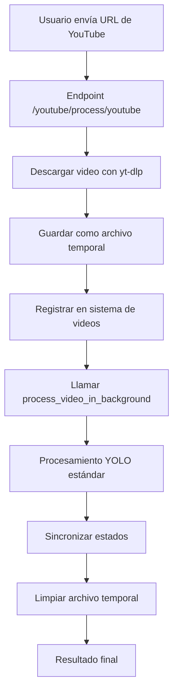

# Integración de YouTube - Brand Detector

## Resumen

Este documento describe la nueva implementación de la funcionalidad de YouTube que simplifica el código y garantiza consistencia con el procesamiento de videos normales.

## Arquitectura Anterior vs Nueva

### ❌ Arquitectura Anterior (Problemática)
- YouTube tenía su propia lógica de procesamiento completa
- Duplicación de código entre video y YouTube
- Inconsistencias en criterios de confianza y métricas
- Mantenimiento complejo de dos sistemas paralelos

### ✅ Nueva Arquitectura (Simplificada)
- YouTube solo se encarga de **descargar** el video
- Una vez descargado, **redirige** el flujo a la funcionalidad de video existente
- **Reutilización** completa del código de procesamiento de videos
- **Consistencia** garantizada en detecciones y métricas

## Flujo de Procesamiento



## Componentes Modificados

### 1. `routes/youtube_video.py`

#### Nuevas Funciones:
- `download_youtube_video()`: Descarga videos usando yt-dlp
- `process_youtube_video()`: Orquesta el flujo completo
- `sync_status()`: Sincroniza estados entre sistemas

#### Endpoints Actualizados:
- `POST /youtube/process/youtube`: Simplificado para usar video processing
- `GET /youtube/video/{job_id}`: Acceso a videos procesados
- `GET /youtube/status/{job_id}`: Estado sincronizado

### 2. Dependencias
- **yt-dlp**: Para descarga robusta de videos de YouTube
- **Reutilización**: `process_video_in_background` de upload_videos.py

## Beneficios de la Nueva Implementación

### 🎯 Consistencia
- **Criterios de confianza**: Mismo filtro > 0.5 para todas las detecciones
- **Métricas**: Cálculos idénticos entre video y YouTube
- **Formato de salida**: Estructura uniforme de resultados

### 🔧 Mantenibilidad
- **Código único**: Una sola implementación de procesamiento
- **Menos bugs**: Reducción de duplicación = menos puntos de falla
- **Actualizaciones**: Cambios en video se aplican automáticamente a YouTube

### 🚀 Rendimiento
- **Optimizaciones**: Beneficios automáticos de mejoras en video processing
- **Recursos**: Mejor gestión de memoria y CPU
- **Limpieza**: Eliminación automática de archivos temporales

## Configuración y Uso

### Requisitos
```bash
# yt-dlp ya está incluido en requirements.txt
yt-dlp==2025.8.27
```

### Estructura de Directorios
```
backend/
├── temp_videos/
│   ├── youtube/          # Videos descargados temporalmente
│   └── processed_*       # Videos procesados
└── routes/
    ├── youtube_video.py  # Endpoints de YouTube
    └── upload_videos.py  # Procesamiento de videos
```

### Ejemplo de Uso

```python
# Solicitud de procesamiento
POST /youtube/process/youtube
{
    "url": "https://www.youtube.com/watch?v=VIDEO_ID"
}

# Respuesta
{
    "job_id": "youtube-job-1234567890",
    "status": "processing"
}

# Monitoreo de progreso
GET /youtube/status/youtube-job-1234567890
{
    "status": "processing",
    "progress": 45,
    "frame_count": 1200,
    "total_frames": 2500,
    "video_title": "Título del Video",
    "detections": 15
}
```

## Estados del Procesamiento

| Estado | Descripción |
|--------|-------------|
| `initializing` | Preparando descarga |
| `downloading` | Descargando video de YouTube |
| `processing` | Procesando con YOLO |
| `completed` | Procesamiento exitoso |
| `error` | Error en cualquier etapa |

## Gestión de Archivos

### Archivos Temporales
- **Ubicación**: `backend/temp_videos/youtube/`
- **Formato**: `{job_id}.{ext}`
- **Limpieza**: Automática al completar procesamiento

### Videos Procesados
- **Ubicación**: `backend/temp_videos/`
- **Formato**: `processed_{job_id}.mp4`
- **Acceso**: Via endpoint `/youtube/video/{job_id}`

## Sincronización de Estados

La nueva implementación mantiene dos sistemas de estado sincronizados:

1. **YouTube Job Status**: Estado específico de YouTube
2. **Video Job Status**: Estado del procesamiento de video

La sincronización se realiza cada 2 segundos hasta completar el procesamiento.

## Pruebas

Ejecuta el script de pruebas incluido:

```bash
python test_youtube_integration.py
```

Este script verifica:
- ✅ Descarga correcta de videos
- ✅ Procesamiento con funcionalidad de video
- ✅ Sincronización de estados
- ✅ Limpieza de archivos temporales

## Migración desde Versión Anterior

### Cambios Breaking
- Los endpoints mantienen la misma interfaz externa
- El formato de respuesta es compatible
- Los job_ids siguen el mismo patrón

### Beneficios Inmediatos
- Criterios de confianza consistentes
- Mejor manejo de errores
- Limpieza automática de archivos
- Métricas más precisas

## Troubleshooting

### Problemas Comunes

1. **Error de descarga de YouTube**
   - Verificar que la URL sea válida
   - Comprobar conectividad a internet
   - Revisar logs de yt-dlp

2. **Archivos temporales no se eliminan**
   - Verificar permisos de escritura
   - Comprobar espacio en disco
   - Revisar logs de limpieza

3. **Estados no sincronizados**
   - Verificar que ambos sistemas estén activos
   - Comprobar locks de threading
   - Revisar logs de sincronización

### Logs Relevantes
```bash
# Descarga de YouTube
2025-01-XX XX:XX:XX - youtube_video - INFO - Iniciando descarga de YouTube: URL

# Procesamiento
2025-01-XX XX:XX:XX - youtube_video - INFO - Procesando video descargado con funcionalidad de video normal

# Sincronización
2025-01-XX XX:XX:XX - youtube_video - INFO - Procesamiento de YouTube completado para job ID

# Limpieza
2025-01-XX XX:XX:XX - youtube_video - INFO - Archivo temporal eliminado: PATH
```

## Conclusión

La nueva implementación de YouTube logra:

- **Simplicidad**: YouTube solo descarga, video procesa
- **Consistencia**: Mismos criterios y métricas
- **Mantenibilidad**: Código único y reutilizable
- **Robustez**: Mejor manejo de errores y limpieza

Esta arquitectura garantiza que cualquier mejora en el procesamiento de videos se aplique automáticamente a YouTube, manteniendo ambas funcionalidades sincronizadas y consistentes.